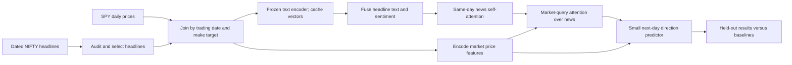

# Pipeline map

This diagram maps the paper's key idea to the smaller public-data prototype. Solid boxes are planned processing steps; only dataset download and audit are implemented so far.

## Why each step exists

1. **Audit and select:** NIFTY supplies many headlines per date. We need a fixed selection rule and must know how many dates/headlines we actually have.
2. **Join and target:** for date `d`, inputs must be available before the prediction decision; target is whether SPY's next trading-day close exceeds its close on `d`. NIFTY's provided labels use three classes, while the FININ paper uses a binary target, so we will derive and audit our own label from SPY prices.
3. **Frozen text encoder:** compute headline vectors once on the stronger machine, then store them. This keeps repeated training runs small.
4. **Fusion and attention:** preserve FININ's distinctive mechanism: individual headline representations, news-to-news interaction, then market-based weighting of headlines.
5. **Evaluation:** compare with always-up, prices-only, sentiment aggregation, and mean-pooled news on identical held-out dates. Inspect headline weights as model diagnostics, not causal evidence.

## Boundaries and unknowns

- The paper uses Reuters/TRNA sentiment scores; a public proxy will need a separately documented sentiment method.
- NIFTY has daily headline groupings rather than reliable individual release timestamps. Any claim about an executable trading strategy needs a stricter timing audit.
- Model configuration and training code have not been selected or written yet.

