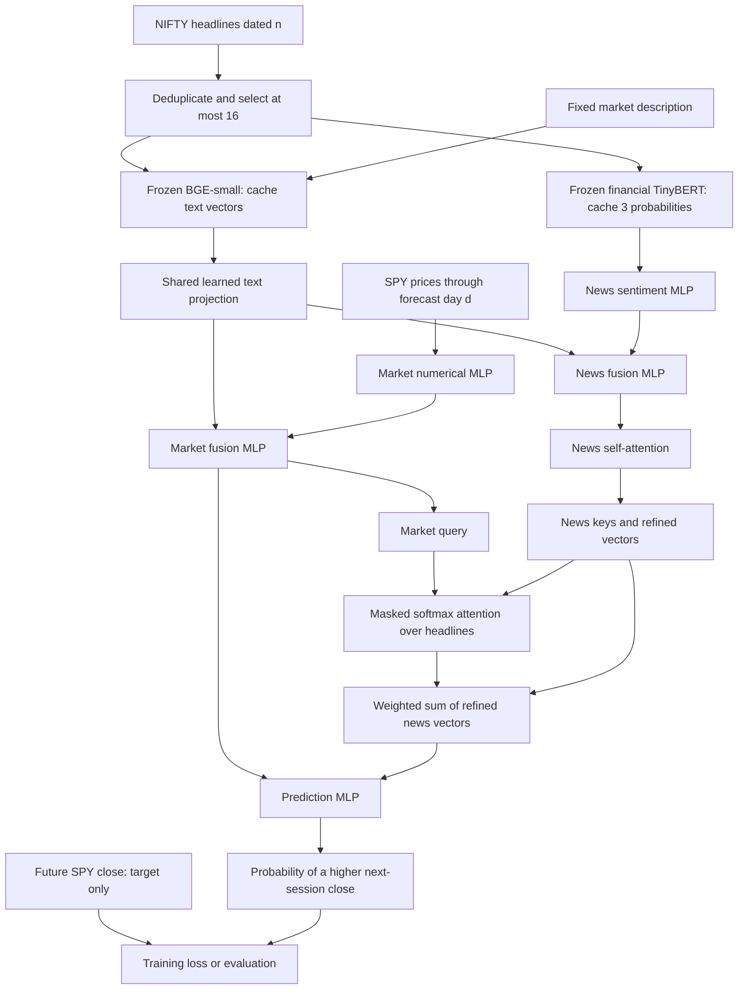
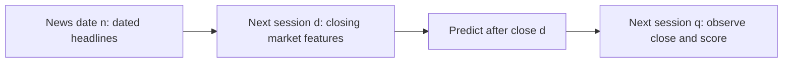

# Pipeline and code map

Architecture checked against FININ Figure 2 and Eqs. 1-7. The complete pipeline has run on the workstation. See the [held-out results](../reports/results.md) for its measured outcome.

## Data flow

Market and headline text share projection parameters. Market/news fusion MLPs remain separate. Future closing prices enter only the target. Frozen encoders run once during feature preparation, outside training.

## Time alignment

Example: January 6 headlines, January 7 market features, predict January 8 close versus January 7 close. The delay addresses missing individual release times, subject to correct date buckets. Version 1 uses one input day.

## Code layout

The table maps each code file to a concrete job. The benchmark, integrity tests and fixed comparison all completed.

| Path | Responsibility / paper mapping |
| --- | --- |
| `scripts/01_download_nifty.py` | Existing: fetch pinned source files |
| `scripts/02_audit_nifty.py` | Existing: inspect raw schema, dates, counts and duplicates |
| `scripts/03_prepare_data.py` | Snapshot prices; create examples, targets and manifests |
| `scripts/04_cache_features.py` | Run frozen BGE/financial TinyBERT once; save arrays and provenance |
| `scripts/05_run_experiments.py` | Fixed baseline/ablation runs; checkpoints and logs |
| `scripts/06_export_results.py` | Held-out predictions, metrics, figures and offline report |
| `src/data/nifty.py` | Source-specific headline parser |
| `src/data/prices.py` | Price source, trading calendar and target alignment |
| `src/data/examples.py` | Common schema, boundary purge, headline selection and masks |
| `src/features/cache.py` | Frozen BGE text features and finance TinyBERT probabilities; save model revisions and output ordering |
| `src/models/encoders.py` | Text projection and numerical/fusion MLPs, Eqs. 1-5 |
| `src/models/attention.py` | News interaction and market-query weighting, section 4.2 / Eq. 6 |
| `src/models/finin.py` | Connect fusion, attention, aggregation and prediction, Eq. 7 |
| `src/models/baselines.py` | Baselines and controlled ablations |
| `src/training.py` | Training loop, early stopping, seeds and checkpoints |
| `src/evaluation.py` | Classification metrics and per-date predictions |
| `tests/` | Date/target integrity, masking invariance and gradient checks |
| `scripts/08_verify_prototype.py` | Rebuild data, replay all checkpoints, verify attention diagnostics and fit a tiny training batch |
| `scripts/09_build_progress_report.py` | Refresh measured results in the LaTeX meeting report and compile it |

Each example records news date, forecast date, target date, selected headline IDs, split and target. Caches record model revisions. Runs record code/data fingerprint, environment, seeds, timing and held-out predictions. The presentation explains transformations using worked examples and the paper-to-prototype comparison.

See [the full plan](../REPRODUCTION_PLAN.md) and [prototype audit](../reports/prototype_audit.json).
